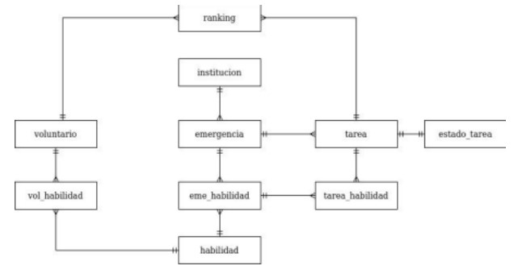
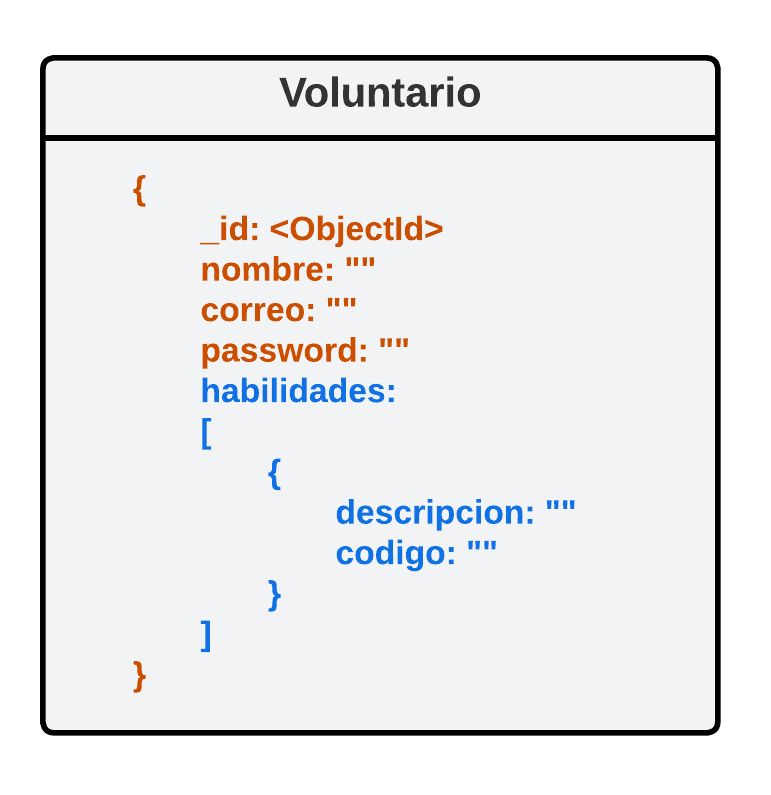
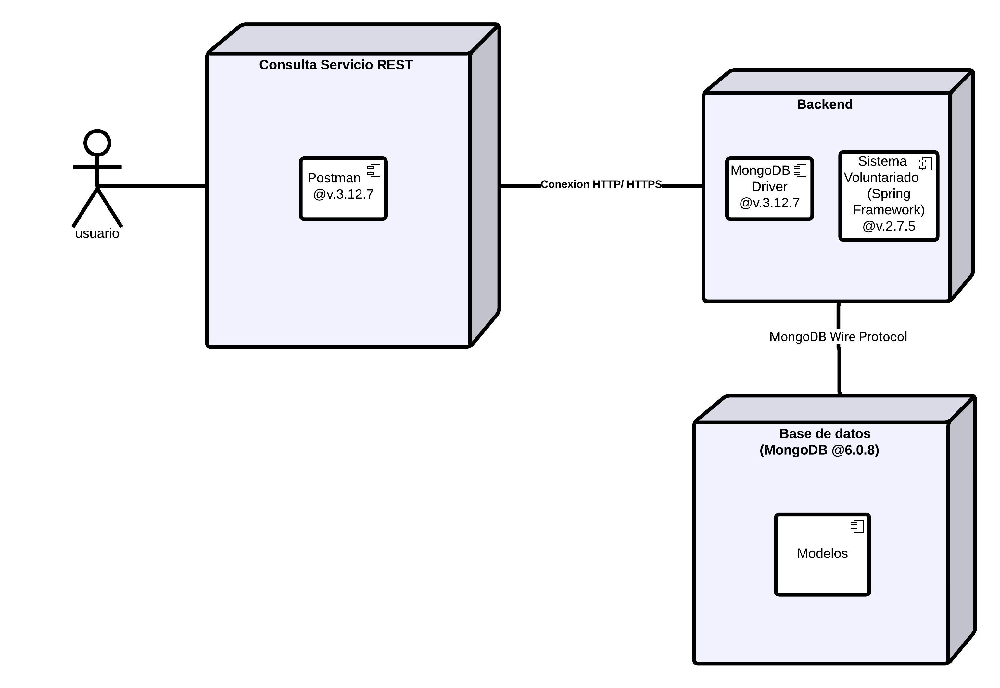

# Laboratorio 3 BDA
---

Laboratorio 3 de la asignatura de Base de Datos Avanzadas de la Universidad de Santiago de Chile ([USACH][9]).


# Tabla de contenidos
---

- [Laboratorio 3 BDA](#laboratorio-3-bda)
- [Tabla de contenidos](#tabla-de-contenidos)
- [Integrantes](#integrantes)
- [Descripción](#descripción)
- [Instrucciones de uso e instalación](#instrucciones-de-uso-e-instalación)
- [Funcionalidades realizadas](#funcionalidades-realizadas)
- [Diagramas de Arquitectura](#diagramas-de-arquitectura)
  - [Modelo Json](#modelo-json)
  - [Vista Física](#vista-física)


# Integrantes 
---

* [Samoth Godoy Madueño][8]
* [Matías Figueroa Contreras][6]
* [Cristóbal Marchant Osorio][7]
* [Diego Oliva López][5]
* [Juan Ramírez Montero][4]

# Descripción

 En el Laboratorio 3 del curso, nos guiaremos utilizando el mismo modelo que se utilizó en los laboratorios anteriores. En esta ocasión, nos centraremos en trabajar con consultas en una Base de Datos No Relacional (No SQL), específicamente utilizando MongoDB. Al igual que en los laboratorios anteriores, no se desarrollará la parte del Frontend y todas las consultas se realizarán exclusivamente a través de Postman. El enfoque principal será desarrollar el Backend utilizando Java y establecer las conexiones necesarias con MongoDB para ejecutar las consultas requeridas en el Laboratorio 3 del curso.

 

#  Instrucciones de uso e instalación
---

Para comenzar se debe instalar un entorno de desarrollo, donde para este caso utilizamos [Intellij IDEA][10] en la versión 2022.2.2. 
Después se debe descargar [MongoDb][3] en la versión 6.0.8. Luego una vez instalada la aplicación debemos abrir la consola e ingresar el siguiente comando para  crear y poblar la base de datos:

```sh
mongosh < dummy.json
```
Para realizar las pruebas  se debe descargar la versión 10.16.0 [Postman][11] para luego realizar todas las peticiones correspondientes a las funcionalidades.

# Funcionalidades realizadas


---
**1.-**  Modelar la tabla Voluntarios como una colección de MongoDB

**2.-** Modelar la tabla Habilidades como una colección incrustada de MongoDB, cada habilidad debe tener como atributos mínimos una descripción y un código alfanumérico, ej: "HH1"

**3.-** Hacer una consulta en un servicio REST para obtener el total de habilidades para los voluntarios registrados


# Diagramas de Arquitectura 
---
Los diagramas implementados para este laboratorio son los siguientes:

## Modelo Json

 

## Vista Física




[1]: https://nodejs.org/es
[2]: https://www.jetbrains.com/es-es/idea/download/#section=windows
[3]: https://www.mongodb.com/try/download/community
[4]: https://github.com/jnramirezm
[5]: https://github.com/D4ig0
[6]: https://github.com/MatiasFigueroaContreras
[7]: https://github.com/cristowo
[8]: https://github.com/Samoth1
[9]: https://www.usach.cl/
[10]: https://www.jetbrains.com/es-es/idea/download/?section=windows
[11]: https://www.postman.com/downloads/